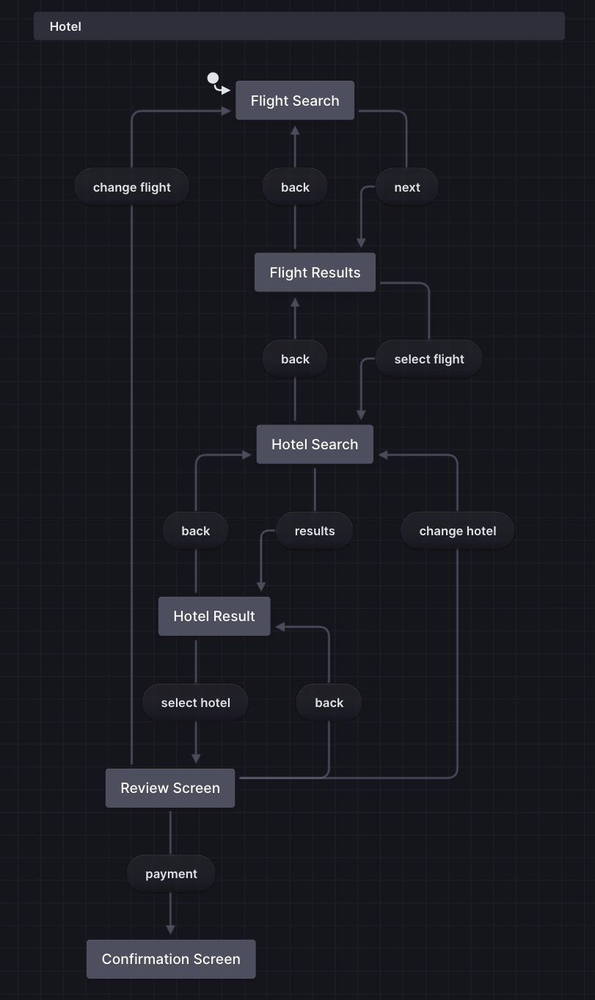

# React State Anti-patterns

## Core Principles
1. Derive, Don't Store - If you can calculate a value from existing data, don't store it in state. Calculate it directly in render or use `useMemo` for expensive calculations.
2. Use Refs for Non-Rendering Values - Use `useRef` for values that don't affect the UI (timers, DOM references, analytics data) instead of `useState` to avoid unnecessary re-renders.
3. Single Source of Truth - Store minimal state and derive everything else. Avoid duplicating the same data in multiple places.

## Common Anti-patterns to Avoid
- Derived State: Using `useState` + `useEffect` to sync calculated values
- Refs as State: Using `useState` for values that don't need re-renders
- Redundant State: Storing full objects when only IDs are needed, or duplicating data already available elsewhere

## Benefits of Following Best Practices
- Eliminates synchronization bugs
- Reduces state complexity
- Better performance (fewer re-renders)
- Easier to debug and maintain
- Automatic data consistency

# Modeling your application

## Core Philosophy
Document Before You Code - Even simple text-based modeling prevents over-engineering and reveals edge cases early.
## Three Essential Documentation Types
1. `Entity Relationship Diagrams (ERD)` - Document your data model and relationships between entities (Users, Flights, Hotels, Bookings, etc.)
    - [**dbdiagrams.io**](https://dbdiagram.io/)
2. `Sequence Diagrams` - Map out how different parts of your system interact (UI → API → Database flows)
    - [**swimlanes.io**](https://swimlanes.io/)
3. `State Diagrams` - Define all possible application states and transitions (idle → searching → results → booking → confirmation)
    - [**stately.ai**](https://stately.ai/)
#### Example: 

## Why Simple Text Works Better
- Lives alongside code in version control
- Easy to update and keep in sync
- No special tools required
- Forces clear thinking about the problem

## Benefits
- Faster development - Less time figuring out what to build
- Fewer bugs - Edge cases discovered before coding
- Better testing - Clear states make test cases obvious
- Easier onboarding - New developers understand the system quickly
- Confident refactoring - Well-documented behavior makes changes safer