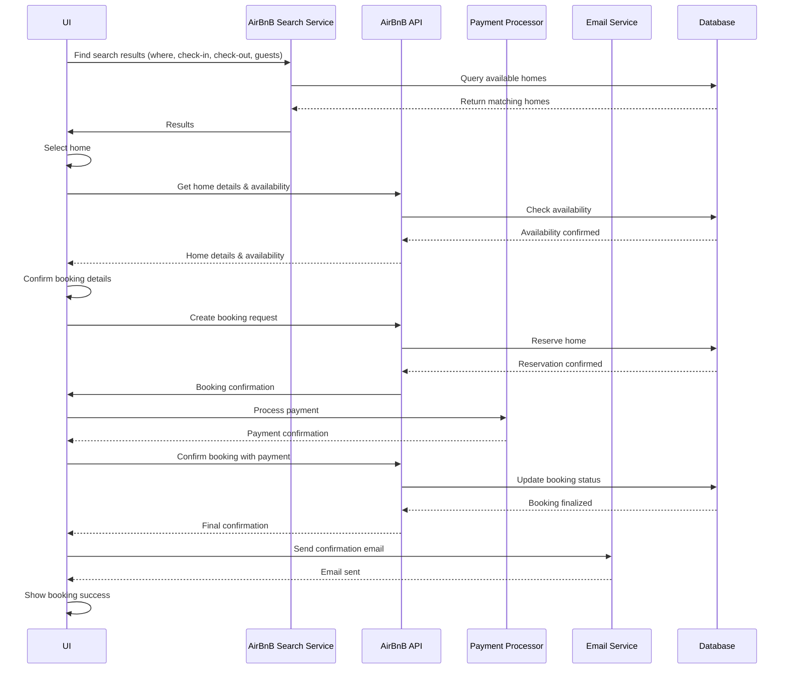

# Entity relationship

```
- Destinations
  - id
- Homes
  - id
  - destinationId
- User
  - Name
  - Id
```

#### [Mermaid Diagram](https://mermaid.live/)
```
erDiagram
    Destinations {
        string id PK
    }
    
    Homes {
        string id PK
        string destinationId FK
    }
    
    User {
        string id PK
        string name
    }
    
    Destinations ||--o{ Homes : "contains"
```


# Sequence diagram

```
- UI -> AirBnB search service: Find search results for this query (where, check in, checkout, and # of guests)
- AirBnB search service -> UI: Results
- UI -> UI: Select home
- UI -> AirBnB API: Booking
- AirBnB API -> UI: Payment information
- UI -> Payment processor:
```

#### [Mermaid Diagram](https://mermaid.live/)



# State diagram
```
- Start with destination When the destination is input, put in the check in date
- Then put in the checkout date
- Then add the number of guests
- And then when the user presses search, it'll take us to a search results page
- The search results will be loading, and eventually show up
- The user can click on one of the homes and be taken to a details page
- They can go back from the details page back to the search page
```

#### [Mermaid Diagram](https://mermaid.live/)
```
stateDiagram-v2
    [*] --> DestinationInput
    DestinationInput --> CheckInDate: destination entered
    CheckInDate --> CheckOutDate: check-in date entered
    CheckOutDate --> GuestCount: check-out date entered
    GuestCount --> SearchLoading: guests entered + search pressed
    SearchLoading --> SearchResults: results loaded
    SearchResults --> HomeDetails: home selected
    HomeDetails --> SearchResults: back button pressed
    SearchResults --> SearchLoading: search again
    GuestCount --> CheckOutDate: back button pressed
    CheckOutDate --> CheckInDate: back button pressed
    CheckInDate --> DestinationInput: back button pressed
```


#### [xState Diagram](https://mermaid.live/)
```typescript
import { createMachine } from 'xstate';

const bookingMachine = createMachine({
  id: 'booking',
  initial: 'destinationInput',
  states: {
    destinationInput: {
      on: {
        DESTINATION_ENTERED: 'checkInDate'
      }
    },
    checkInDate: {
      on: {
        CHECKIN_ENTERED: 'checkOutDate',
        BACK: 'destinationInput'
      }
    },
    checkOutDate: {
      on: {
        CHECKOUT_ENTERED: 'guestCount',
        BACK: 'checkInDate'
      }
    },
    guestCount: {
      on: {
        GUESTS_ENTERED: 'searchLoading',
        BACK: 'checkOutDate'
      }
    },
    searchLoading: {
      on: {
        RESULTS_LOADED: 'searchResults',
        ERROR: 'guestCount'
      }
    },
    searchResults: {
      on: {
        HOME_SELECTED: 'homeDetails',
        SEARCH_AGAIN: 'searchLoading',
        BACK: 'guestCount'
      }
    },
    homeDetails: {
      on: {
        BACK: 'searchResults',
        BOOK_NOW: 'bookingConfirmation'
      }
    },
    bookingConfirmation: {
      on: {
        CONFIRMED: 'payment',
        BACK: 'homeDetails'
      }
    },
    payment: {
      on: {
        PAYMENT_SUCCESS: 'success',
        PAYMENT_ERROR: 'bookingConfirmation'
      }
    },
    success: {
      type: 'final'
    }
  }
});
```

